# django 1029

* DRF(Django Rest Framework)를 활용한 API Server 제작

* Database 1:N, M:N 관계의 이해와 데이터 관계 설정


## A. Model

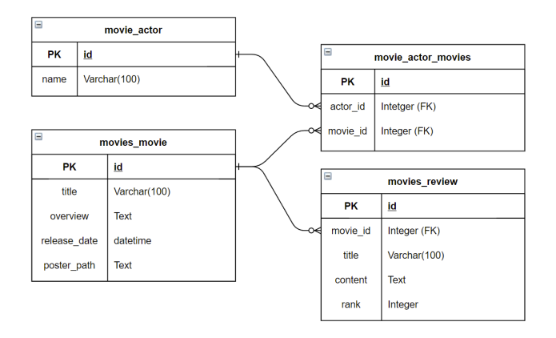

- 코드 `models.py` 

```python
from django.db import models


class Actor(models.Model):
    name = models.CharField(max_length=100)

    def __str__(self):
        return f"{self.pk}: {self.name}"


class Movie(models.Model):
    actors = models.ManyToManyField(Actor, related_name="movies")
    title = models.CharField(max_length=100)
    overview = models.TextField()
    release_date = models.DateTimeField(auto_now_add=True)
    poster_path = models.TextField()

    def __str__(self):
        return f"{self.pk}: {self.title}"


class Review(models.Model):
    movie = models.ForeignKey(Movie, on_delete=models.CASCADE, related_name="reviews")
    title = models.CharField(max_length=100)
    content = models.TextField()
    rank = models.IntegerField()

    def __str__(self):
        return f"{self.pk}: {self.title}"
```


## B. Serializer

* `serializers\actor.py`

```python
class ActorListSerializer(serializers.ModelSerializer):
    
    class Meta:
        model = Actor
        fields = '__all__'


class ActorSerializer(serializers.ModelSerializer):

    class MovieListSerializer(serializers.ModelSerializer):
        class Meta:
            model = Movie
            fields = ('id', 'title',)
	# actor 상세 조회 시 출연한 movies 정보 함께 조회
    movies = MovieListSerializer(many=True, read_only=True)
    
    class Meta:
        model = Actor
        fields = '__all__'
```

- `serializers\movie.py` 

```python
class MovieListSerializer(serializers.ModelSerializer):
    
    class Meta:
        model = Movie
        fields = ('id', 'title',)


class MovieSerializer(serializers.ModelSerializer):

    class ActorListSerializer(serializers.ModelSerializer):
        class Meta:
            model = Actor
            fields = '__all__'

    class ReviewListSerializer(serializers.ModelSerializer):
        class Meta:
            model = Review
            fields = ('id', 'title',)
	# movie 상세 조회 시 출연한 actors 및 등록된 review 정보 조회
    actors = ActorListSerializer(many=True, read_only=True)
    reviews = ReviewListSerializer(many=True, read_only=True)
	
    # 영화 데이터 생성 시 출연배우 등록 
    # JSON 으로 actor 들의 pk를 받아 추가한다.
    actor_pks = serializers.ListField(write_only=True)
    
    def create(self, validated_data):
        actor_pks = validated_data.pop('actor_pks')
        movie = Movie.objects.create(**validated_data)

        for actor_pk in actor_pks:
            movie.actors.add(actor_pk)
        
        return movie

    class Meta:
        model = Movie
        fields = ('id', 'title', 'overview', 'poster_path', 'actors', 'reviews', 'actor_pks',)
```


- `serializers\review.py` 

```python
class ReviewListSerializer(serializers.ModelSerializer):
    
    class Meta:
        model = Review
        fields = ('id', 'title',)
    

class ReviewSerializer(serializers.ModelSerializer):

    class MovieListSerializer(serializers.ModelSerializer):
        class Meta:
            model = Movie
            fields = ('id', 'title',)

    movie = MovieListSerializer(read_only=True)
    
    class Meta:
        model = Review
        fields = '__all__'
```


## C. View

- `views.py` 에서 리뷰 상세조회, 수정, 삭제 

```python
@api_view(["GET", "PUT", "DELETE"])
def review_detail_update_delete(request, review_pk):
    review = get_object_or_404(Review, pk=review_pk)

    def review_detail():
        serializer = ReviewSerializer(review)
        return Response(serializer.data)

    def review_update():
        serializer = ReviewSerializer(review, data=request.data)
        if serializer.is_valid(raise_exception=True):
            serializer.save()
            return Response(serializer.data)

    def review_delete():
        review.delete()
        data = {"msg": f"{review_pk}번 리뷰가 삭제되었습니다."}
        return Response(data, status=status.HTTP_204_NO_CONTENT)

    if request.method == "GET":
        return review_detail()
    elif request.method == "PUT":
        return review_update()
    elif request.method == "DELETE":
        return review_delete()
```


## D. Postman 결과

* default URI : `http://127.0.0.1:8000/api/v1/`
* GET `actors/` 

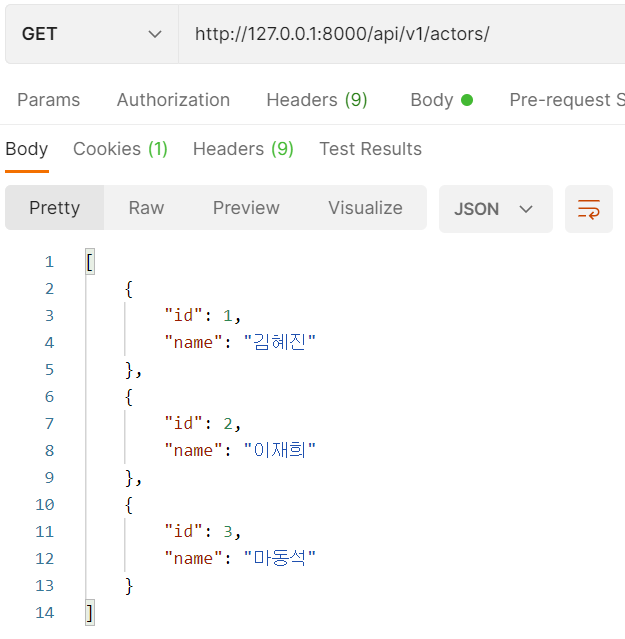

- GET `actors/<actor_pk>/`

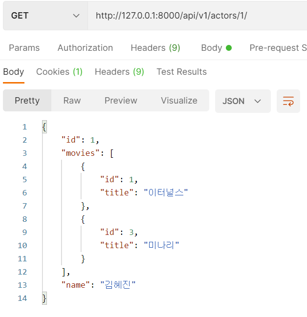

- GET `movies/`

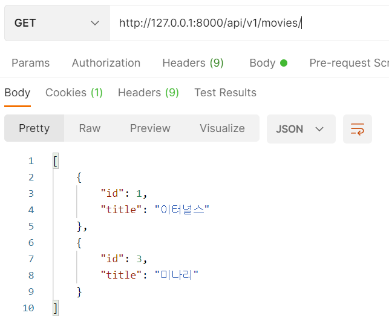

- POST `movies/`

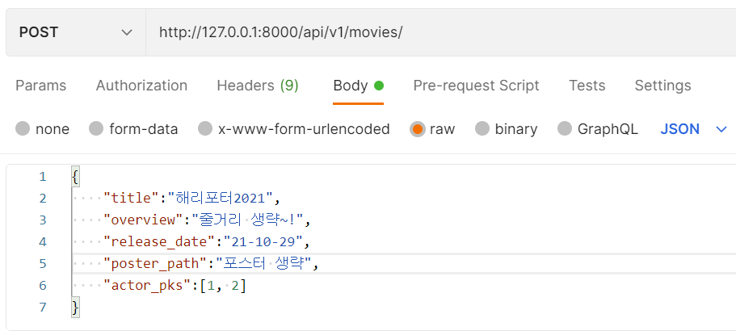

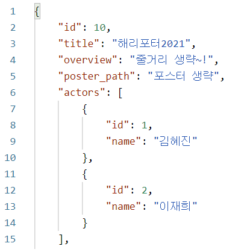

- GET `movies/1/` 

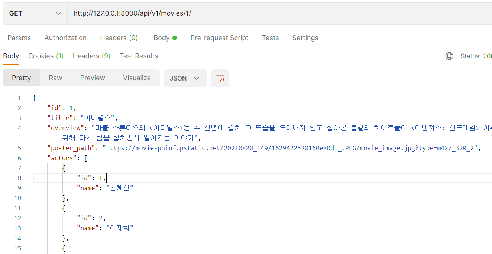

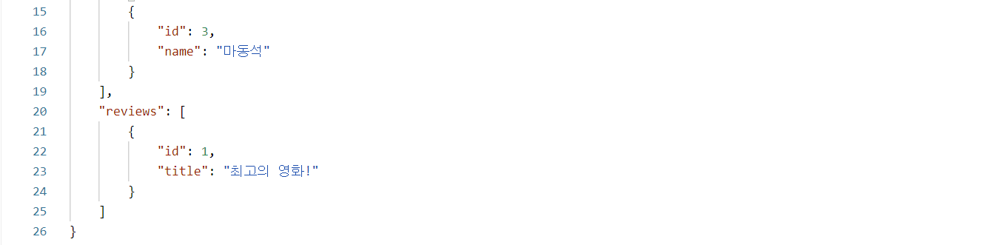

- GET `reviews/` 

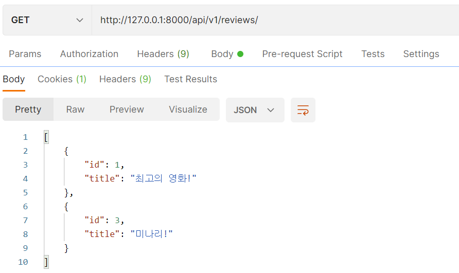

- GET `reviews/<review_pk>/` 

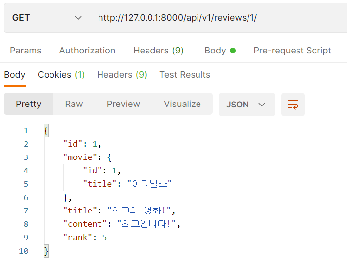

- PUT `reviews/<review_pk>/` 

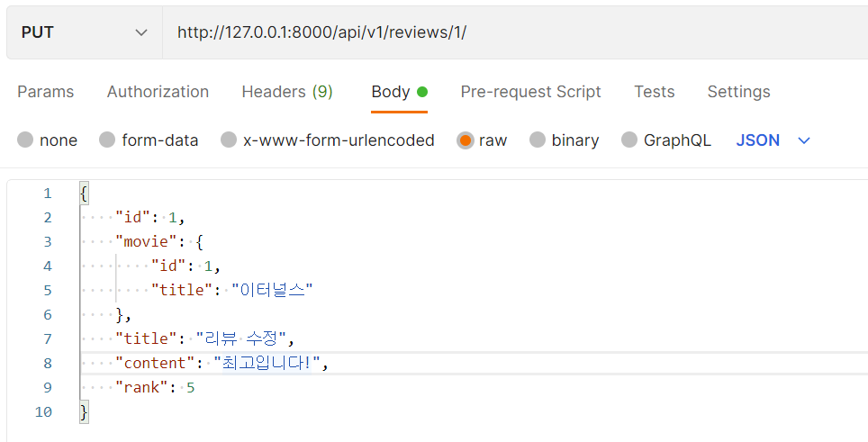

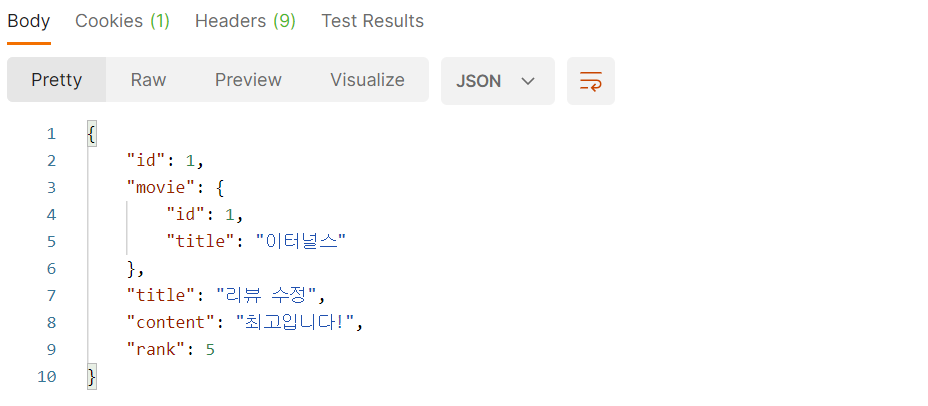

- DELETE `reviews/<review_pk>/` 

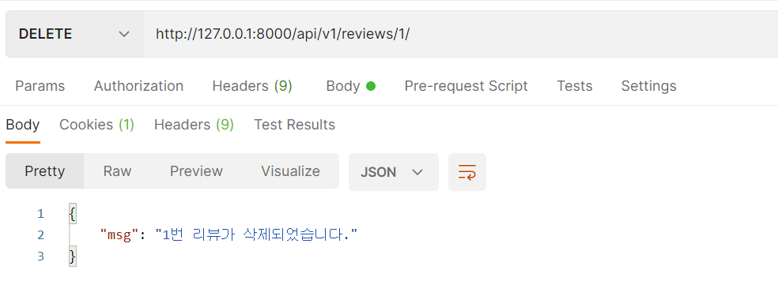

- POST `movies/<movie_pk>/reviews/` 

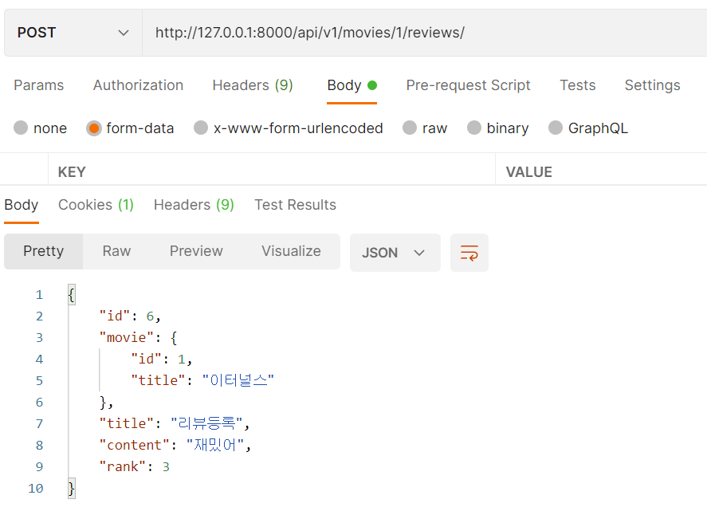


