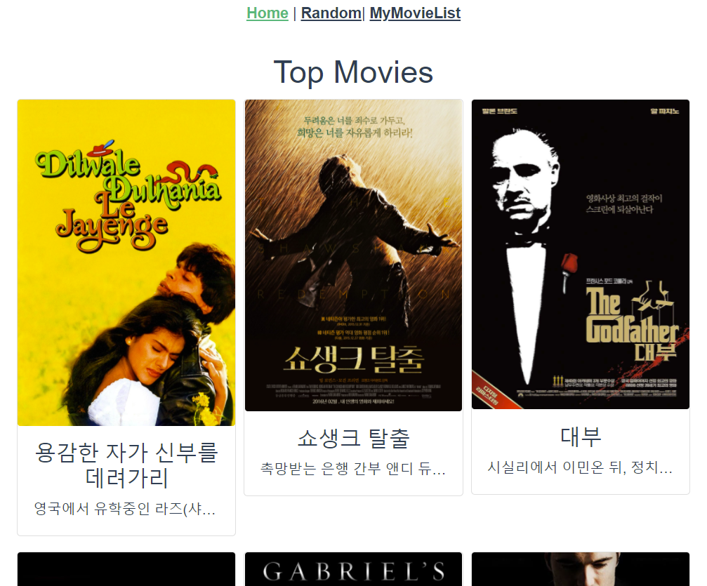
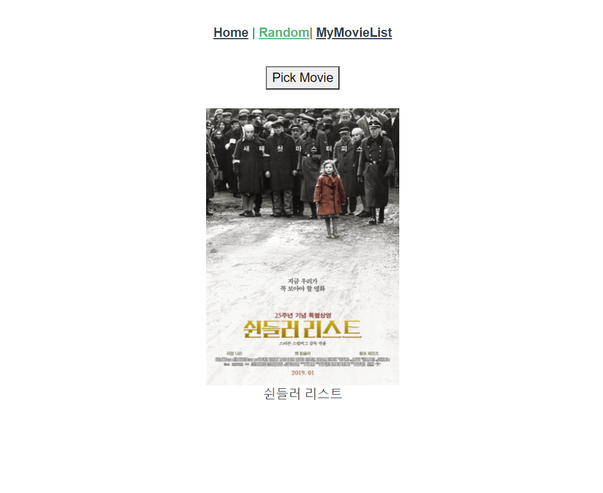
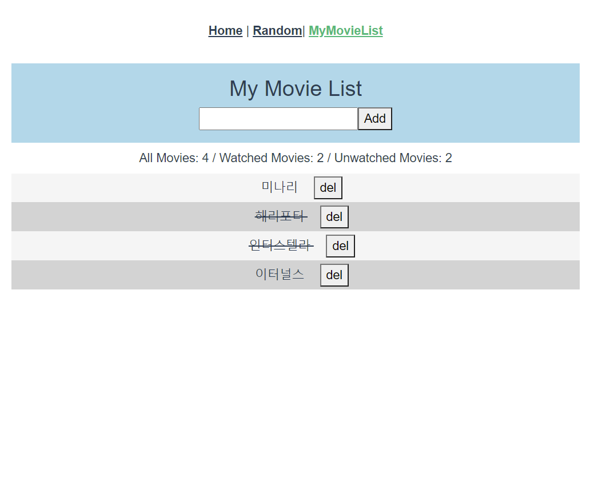

## 주 내용

* 영화 정보를 제공하는 SPA(Single Page Application) 제작
* AJAX 통신과 JSON 구조에 대한 이해
* vue-cli, vuex, vue-router 등 플러그인 활용


## [참고] Vue.js에서 Bootstrap 적용하는 법

#### - 패키지 설치

```
npm install vue bootstrap-vue bootstrap
```

#### - main.js에 추가

```javascript
import BootstrapVue from 'bootstrap-vue'
import 'bootstrap/dist/css/bootstrap.min.css'
import 'bootstrap-vue/dist/bootstrap-vue.css'

Vue.use(BootstrapVue)
```

#### - 주의

- 일반 부트스트랩 활용법과 다르다.  예) card는  `b-card` 태그 사용

```html
<b-card
      class="mb-2"
      :title="movie.title"
      :img-src="url"
      img-alt="Movie Image"
    >
      <b-card-text class="card-text">
        {{movie.overview}}
      </b-card-text>
    </b-card>
```


## 스타일링 및 결과이미지

* `Home`




- `Random`




* `MyMovieList`


